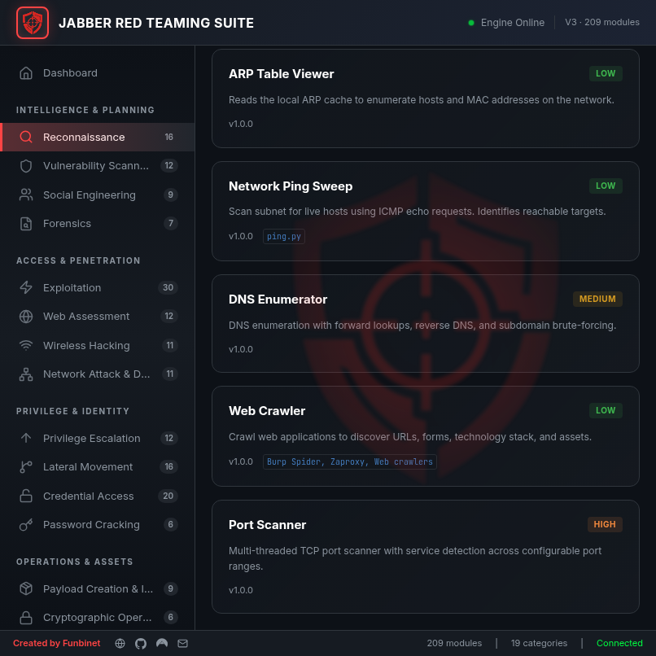
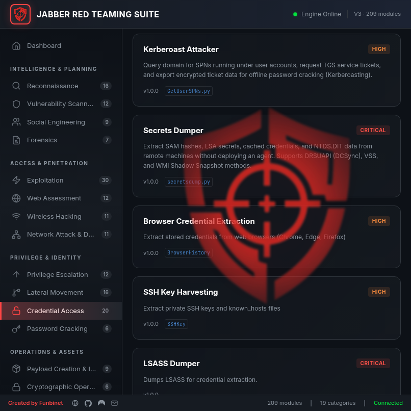
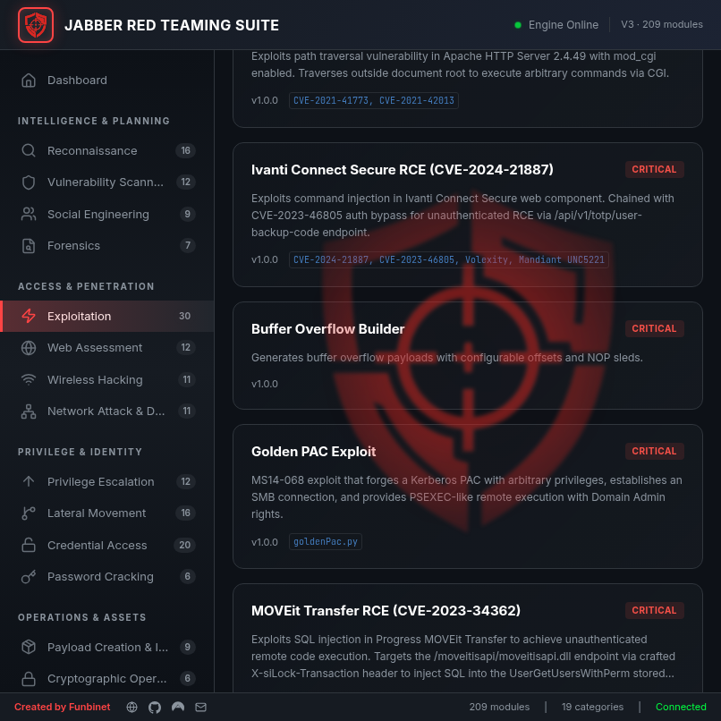
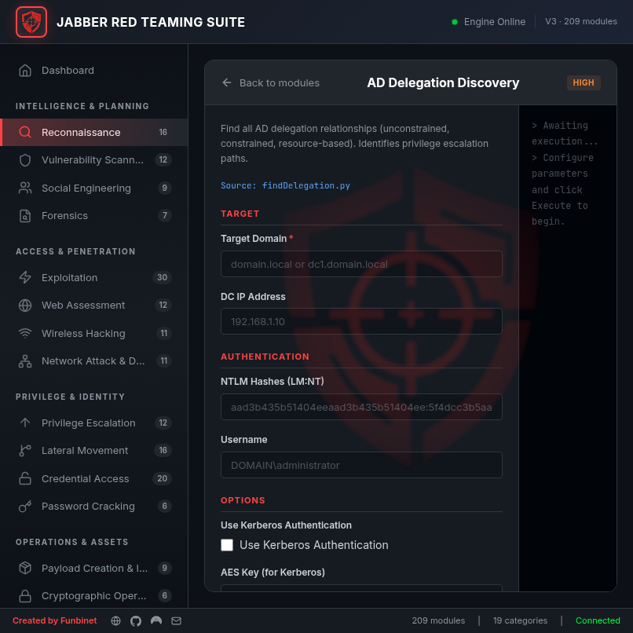

# JABBER Module Catalog — V3

## Complete Reference of 209 Modules Across 19 Attack Lifecycle Categories

This document provides a comprehensive catalog of all module categories, individual modules, their purposes, risk levels, expected inputs/outputs, and role within the JABBER framework.


---

## Table of Contents

1. [Intelligence & Planning](#intelligence--planning)
2. [Access & Exploitation](#access--exploitation)
3. [Persistence & Control](#persistence--control)
4. [Analysis & Reporting](#analysis--reporting)
5. [Module Execution Standards](#module-execution-standards)
6. [Finding Examples](#finding-examples)

---

## Intelligence & Planning

### Category: Reconnaissance



**Purpose**: Gather information about target environments, enumerate services, discover systems, and map attack surfaces for the red team to identify exploitation opportunities.

**Expected Workflow**: 
1. Input target hostname, IP range, or domain
2. Execute reconnaissance module(s)
3. Collect structured findings (hostnames, services, versions)
4. Feed into exploitation planning

**Module Inventory** (14+ modules)

| Module | Purpose | Inputs | Outputs |
|--------|---------|--------|---------|
| **LDAP Status Checker** | Verify LDAP connectivity and version | Domain, Server IP | Status, Version, Schema info |
| **AD User Enumerator** | List Active Directory users | Domain, Credentials | User list, Properties |
| **DNS Enumerator** | Enumerate DNS records and services | Domain | A/AAAA/MX/SRV records |
| **Port Scanner** | Identify open ports and services | Target IP, Port range | Open ports, Service versions |
| **SMB Enumerator** | Discover SMB shares and enumeration | Target Host | Share list, Permissions |
| **WMI Enumerator** | Query Windows Management Instrumentation | Target Host, Credentials | System info, Processes |
| **Service Enumerator** | List running services on systems | Target Host | Service list, Details |
| **Computer Discoverer** | Find computers on network | Domain, Credentials | Computer list, Properties |
| **Group Policy Analyzer** | Extract Group Policy objects | Domain, Credentials | GPO names, Settings |
| **Trust Relationship Mapper** | Map domain trust relationships | Domain | Trust list, Direction |
| **Delegation Finder** | Identify delegation configurations | Domain, Credentials | Delegation list, Type |
| **Printer Enumerator** | Discover network printers | Network range | Printer list, Details |
| **File Share Scanner** | Identify accessible file shares | Target network | Share list, Access level |
| **Application Inventory** | Enumerate installed applications | Target Host | Application list, Versions |

---

### Category: Intelligence

**Purpose**: Analyze gathered reconnaissance data, correlate findings, identify patterns, and determine high-value targets and attack vectors.

**Expected Workflow**:
1. Import reconnaissance findings
2. Correlate data across multiple sources
3. Identify critical systems and services
4. Prioritize exploitation targets

**Module Inventory** (8+ modules)

| Module | Purpose | Inputs | Outputs |
|--------|---------|--------|---------|
| **Vulnerability Correlator** | Cross-reference CVEs with discovered services | Service list, Versions | CVE list, Severity |
| **Trust Chain Analyzer** | Analyze attack paths through trust relationships | Trust list, Users | Attack path list |
| **Permission Mapper** | Map permissions across resources | ACLs, Users | Permission matrix |
| **Credential Value Assessor** | Prioritize credentials by usefulness | User list, Roles | Priority ranking |
| **Network Topology Builder** | Construct network topology visualization | Network data | Topology diagram |
| **Exposure Risk Calculator** | Calculate overall exposure and risk | Vulnerability list | Risk score, Recommendations |
| **Lateral Movement Analyzer** | Identify lateral movement opportunities | Network data, Credentials | Movement paths |
| **Persistence Opportunity Finder** | Identify persistence mechanisms | System inventory | Persistence methods |

---

### Category: Planning

**Purpose**: Document attack strategies, build playbooks, establish operational security measures, and structure engagement approach.

**Expected Workflow**:
1. Define objectives and scope
2. Document methodology
3. Establish security measures
4. Build execution playbook

**Module Inventory** (6+ modules)

| Module | Purpose | Inputs | Outputs |
|--------|---------|--------|---------|
| **Engagement Planner** | Structure engagement scope and objectives | Client info, Timeline | Engagement plan |
| **Methodology Builder** | Construct testing methodology | Objectives, Timeline | Methodology document |
| **Timeline Generator** | Create execution timeline | Phases, Duration | Timeline, Milestones |
| **OpSec Planner** | Define operational security measures | Risks, Mitigations | OpSec plan |
| **Escalation Path Mapper** | Map incident escalation procedures | Contacts, Procedures | Escalation plan |
| **Reporting Template Creator** | Generate engagement report templates | Findings, Client | Report template |

---

### Category: Evasion Assessment

**Purpose**: Evaluate detection and evasion risks, analyze defensive posture, and plan evasion tactics before executing modules.

**Expected Workflow**:
1. Analyze defensive capabilities
2. Evaluate detection likelihood
3. Plan evasion techniques
4. Adjust execution strategy

**Module Inventory** (5+ modules)

| Module | Purpose | Inputs | Outputs |
|--------|---------|--------|---------|
| **EDR Detector** | Identify EDR/AV presence | Target Host, Credentials | Detected tools, Capabilities |
| **Firewall Analyzer** | Analyze firewall rules and egress filtering | Network, Credentials | Firewall rules, Restrictions |
| **Logging Assessment** | Evaluate logging capabilities | Target environment | Log sources, Retention |
| **Evasion Recommendation Engine** | Suggest evasion techniques | Defensive posture | Evasion tactics |
| **Risk Calculator** | Calculate detection risk for techniques | Technique, Defenses | Risk score, Mitigation |

---

## Access & Exploitation

### Category: Credential Access



**Purpose**: Extract, compromise, or recover credentials (passwords, tokens, certificates) to gain authenticated access to systems and services.

**Expected Workflow**:
1. Identify credential storage locations
2. Extract or dump credentials
3. Crack offline credentials if necessary
4. Use credentials for lateral movement

**Module Inventory** (25+ modules)

| Module | Purpose | Inputs | Outputs |
|--------|---------|--------|---------|
| **Secrets Dumper** | Extract credentials from memory/files | Target Host, Credentials | Password hashes, Plaintext |
| **AS-REP Roaster** | Attack Kerberos AS-REP for offline cracking | Domain, Username | AS-REP hash |
| **Kerberoast Attacker** | Extract Kerberos service tickets | Domain, Credentials | Service ticket, Hash |
| **Browser Password Extractor** | Recover browser stored passwords | Target Host | Saved passwords, URLs |
| **LAPS Password Reader** | Extract LAPS managed passwords | Domain, Credentials | LAPS password |
| **GPP Password Extractor** | Recover Group Policy Preferences passwords | Domain, Credentials | Decrypted password |
| **DPAPI Credential Dumper** | Extract DPAPI protected secrets | Target Host, Credentials | DPAPI credentials |
| **SAM Database Dumper** | Extract SAM registry hashes | Target Host | SAM hashes |
| **NTDS.dit Dumper** | Extract Active Directory database | Domain Controller, Creds | Extracted AD database |
| **SSH Key Stealer** | Recover SSH private keys | Target Host | Private keys |
| **API Token Extractor** | Extract API tokens from applications | Target Host, App list | API tokens |
| **Certificate Dumper** | Extract certificates and keys | Target Host | Certificates, Keys |
| **Kerberos TGT Dumper** | Extract Kerberos tickets | Target Host | Ticket list |
| **Memory Scraper** | Search process memory for credentials | Target Host | Found credentials |
| **Log File Harvester** | Extract credentials from logs | Target Host, Log paths | Log credentials |
| **Registry Credential Reader** | Read stored credentials from registry | Target Host, Credentials | Registry credentials |
| **Vault Password Extractor** | Extract password manager contents | Target Host | Vault credentials |
| **Config File Parser** | Extract credentials from configs | Target Host, Paths | Config credentials |
| **Account Enum Lock Attacker** | AS-REP roasting on locked accounts | Domain | AS-REP hashes |
| **Kerberos Relay Attacker** | Relay Kerberos authentication | Network, Mitm | Relayed tokens |
| **NTLM Hash Cracker** | Offline crack NTLM hashes | NTLM hash list | Cracked passwords |
| **Password Spray Tool** | Spray known passwords | Domain, Password list | Valid credentials |
| **Service Account Finder** | Identify service account passwords | Domain, Credentials | Service accounts |
| **Ticket Renewal Module** | Renew expired Kerberos tickets | Ticket, Domain | Renewed ticket |
| **Multi-Factor Bypass** | Attempt MFA bypass techniques | MFA type, Target | Bypass results |

---

### Category: Exploitation



**Purpose**: Leverage vulnerabilities and misconfigurations to achieve code execution and gain access to systems.

**Expected Workflow**:
1. Identify vulnerable services
2. Select appropriate exploitation technique
3. Execute exploit
4. Achieve shell/code execution

**Module Inventory** (14+ modules)

| Module | Purpose | Inputs | Outputs |
|--------|---------|--------|---------|
| **PSExec Runner** | Execute code via Windows admin shares | Target Host, Credentials | Command output |
| **WMI Executor** | Execute code via Windows Management Instrumentation | Target Host, Credentials | WMI output |
| **SMBExec Runner** | Execute code via SMB named pipes | Target Host, Credentials | Shell, Output |
| **DCOMExec Runner** | Execute code via DCOM objects | Target Host, Credentials | Command output |
| **ATExec Runner** | Execute via Windows Task Scheduler | Target Host, Credentials | Scheduled task, Output |
| **Golden PAC Exploit** | Abuse PAC for administrative access | Domain, Krbtgt hash | Admin access |
| **Ticket TGT Forger** | Create forged Kerberos TGTs | Domain, Key | Forged ticket |
| **Service Ticket Crafter** | Create forged service tickets | SPN, Key | Service ticket |
| **RBCD Exploiter** | Abuse Resource-Based Constrained Delegation | Target, Credentials | Admin access |
| **Shadow Credentials Abuser** | Abuse msDS-KeyCredentialLink attribute | Target, Credentials | Credential access |
| **SQL Injection Module** | Exploit SQL injection vulnerabilities | Target SQL, Injection | Extracted data |
| **Remote Code Exec Finder** | Search for RCE vulnerabilities | Target service, Version | RCE exploits |
| **Container Escape Module** | Escape from containerized environments | Container, Runtime | Host access |
| **Kernel Exploit Runner** | Execute kernel-level exploits | Target OS, Kernel version | Privilege escalation |

---

### Category: Lateral Movement

**Purpose**: Move from compromised systems to other systems on the network, extending foothold and access surface.

**Expected Workflow**:
1. Use compromised credentials to access new systems
2. Execute exploitation techniques to gain access
3. Establish persistence on new systems
4. Repeat for deeper network penetration

**Module Inventory** (16+ modules)

| Module | Purpose | Inputs | Outputs |
|--------|---------|--------|---------|
| **PSExec Lateral** | Execute code on lateral targets | Target Host, Credentials | Shell access |
| **WMI Lateral Movement** | Move via WMI across network | Target Host, Credentials | Code execution |
| **SMB Lateral Executor** | Move using SMB shares | Target Host, Credentials | Shell access |
| **DCOM Lateral** | Exploit DCOM for lateral movement | Target Host, Credentials | Code execution |
| **WinRM Executor** | Remote execution via WinRM | Target Host, Credentials | Command output |
| **RDP Bruteforcer** | Attempt RDP login brute force | Target Host, Credentials | RDP access |
| **Kerberos Relay** | Relay Kerberos authentication | Network position | Relayed access |
| **NTLM Relay Extender** | Extended NTLM relay techniques | Network, Targets | Relayed access |
| **Trusted Impersonation** | Impersonate trusted accounts | Domain, Credentials | Elevated access |
| **Token Stealing ** | Steal access tokens from processes | Target Host | Process tokens |
| **SSH Lateral** | Move via SSH keys/credentials | Target Host, Keys | SSH access |
| **SCP Data Mover** | Copy files via SCP for lateral movement | Source, Target, Keys | File transfer |
| **Mount Share** | Mount remote shares for access | Target Host, Credentials | Mounted share |
| **Port Forward Tunnel** | Create tunnels for lateral access | Source, Target | Tunnel connection |
| **SOCKS Proxy Creator** | Create SOCKS proxy for lateral access | Compromised host | SOCKS tunnel |
| **VPN Accessor** | Connect to target VPN from compromised host | VPN, Credentials | VPN access |

---

### Category: Privilege Escalation

**Purpose**: Elevate access from lower-privileged accounts to higher-privileged accounts (system, domain admin, etc.).

**Expected Workflow**:
1. Enumerate system for privilege escalation vectors
2. Identify misconfigurations or vulnerabilities
3. Execute escalation technique
4. Achieve elevated privileges

**Module Inventory** (12+ modules)

| Module | Purpose | Inputs | Outputs |
|--------|---------|--------|---------|
| **UAC Bypass** | Bypass Windows User Account Control | Windows target | Elevated shell |
| **DACL Exploiter** | Exploit weak DACLs on AD objects | Domain object, Credentials | Elevated access |
| **ACL Escalator** | Find and exploit weak ACLs | Domain, Credentials | Escalation paths |
| **Token Impersonation** | Impersonate high-privilege tokens | Target Host | Impersonated token |
| **Insecure Service Exploiter** | Abuse misconfigurations in services | Service, Target Host | Privilege escalation |
| **Registry Privilege Escalation** | Escalate via registry misconfigurations | Registry paths | Elevated access |
| **Group Policy Abuser** | Abuse GPO for privilege escalation | Domain, Credentials | Escalated privileges |
| **Scheduled Task Hijacker** | Hijack scheduled tasks | System, Task name | Task execution |
| **File Permission Exploiter** | Exploit weak file permissions | File/folder path | File write access |
| **Sudo Misconfiguration Exploiter** | Exploit sudo misconfigurations (Linux) | System, Sudoers | Privilege escalation |
| **SetUID Binary Exploiter** | Exploit SetUID binaries (Linux) | Binary path | Elevated shell |
| **Kernel Vulnerability Exploiter** | Exploit local kernel vulnerabilities | Kernel version | System access |

---

## Persistence & Control

### Category: Persistence

**Purpose**: Establish long-term access to compromised systems, surviving reboots and credential changes to maintain presence.

**Expected Workflow**:
1. Identify persistence mechanisms available on target
2. Select appropriate persistence technique
3. Install persistence backdoor
4. Verify persistence is functional after reboot

**Module Inventory** (15+ modules)

| Module | Purpose | Inputs | Outputs |
|--------|---------|--------|---------|
| **Scheduled Task Inserter** | Create persistent scheduled task | Target Host, Credentials | Persistent task |
| **Registry Run Key Setter** | Add persistence via registry run keys | Target Host, Credentials | Registry key |
| **WMI Event Subscription** | Create WMI event-based persistence | Target Host, Credentials | WMI subscription |
| **Startup Folder Dropper** | Place backdoor in startup folder | Target Host, Credentials | Startup entry |
| **Service Installer** | Install persistence as Windows service | Target Host, Credentials | Service entry |
| **DLL Hijacking Placer** | Create DLL hijacking persistence | Target Host, Path | Hijacked DLL |
| **BITSAdmin Abuse** | Use BITSAdmin for persistence | Target Host, URI | BITS job |
| **COM Hijacking** | Abuse COM objects for persistence | Target Host, Credentials | COM entry |
| **Logon Script Injector** | Inject logon scripts | Domain, Credentials | Logon script |
| **Browser Helper Object** | Install BHO for browser persistence | Target Host | BHO entry |
| **Cron Job Injector** | Install persistence via cron (Linux) | Target Host, Credentials | Cron job |
| **SSH Key Persistence** | Plant SSH keys for persistence | Target Host | SSH key |
| **Shell Profile Modification** | Modify shell profiles for persistence | Target Host, Shell | Profile modification |
| **Kernel Module Loader** | Load kernel module persistence (Linux) | Target Host | Kernel module |
| **Init.D Script Injector** | Inject init.d startup scripts (Linux) | Target Host, Credentials | Init script |

---

### Category: Command & Control

**Purpose**: Establish remote management channels to execute commands, exfiltrate data, and coordinate multi-agent operations across the network.

**Expected Workflow**:
1. Deploy C2 server infrastructure
2. Install C2 agents on compromised systems
3. Establish secure communication channel
4. Execute commands and collect results

**Module Inventory** (8+ modules)

| Module | Purpose | Inputs | Outputs |
|--------|---------|--------|---------|
| **HTTP C2 Server** | Launch HTTP-based C2 server | Port, TLS cert | C2 endpoint |
| **DNS C2 Server** | Launch DNS-based C2 for exfiltration | Domain, DNS server | DNS tunnel |
| **Raw Socket C2** | Launch raw socket C2 server | Port, Protocol | Socket listener |
| **WebSocket C2 Server** | Launch WebSocket C2 for low latency | Port, Host | WebSocket endpoint |
| **C2 Agent Generator** | Generate C2 agent payload | C2 server, Protocol | Agent binary |
| **HTTP Beacon** | Generate HTTP beacon agent | C2 server URL | Beacon binary |
| **DNS Beacon** | Generate DNS beacon agent | Domain, C2 IP | Beacon binary |
| **Multi-Protocol Beacon** | Generate multi-protocol agent | Protocols, Servers | Agent binary |

---

### Category: Defense Evasion

**Purpose**: Avoid, bypass, or disable defensive measures (AV, EDR, logging, firewalls) to remain undetected during operations.

**Expected Workflow**:
1. Analyze defensive capabilities
2. Select evasion techniques
3. Apply evasion before execution
4. Execute operations while evading detection

**Module Inventory** (10+ modules)

| Module | Purpose | Inputs | Outputs |
|--------|---------|--------|---------|
| **Payload Obfuscator** | Obfuscate payload to evade AV/EDR | Payload binary | Obfuscated payload |
| **Code Cave Injector** | Inject code into legitimate binaries | Target binary, Payload | Modified binary |
| **Inline Hooking Patcher** | Apply inline hooking to evade hooks | Target process, Payload | Hooked process |
| **Process Hollowing** | Hollow legitimate process | Legitimate binary, Payload | Hollowed process |
| **PEB Manipulation** | Manipulate Process Environment Block | Target process | Modified PEB |
| **ETW Killer** | Disable Event Tracing for Windows | Target system | ETW disabled |
| **Audit Policy Disabler** | Disable Windows audit logging | Target system | Logging disabled |
| **Windows Defender Disabler** | Disable Windows Defender | Target system | AV disabled |
| **Log Deletion Tool** | Securely delete audit logs | Target system, Log types | Logs deleted |
| **Eventlog Cleaner** | Clear Windows event logs | Target system | Event log cleared |

---

## Analysis & Reporting

### Category: Discovery

**Purpose**: Analyze compromised systems and networks to identify assets, applications, configurations, and data of value for further exploitation or exfiltration.

**Expected Workflow**:
1. Enumerate system/network contents
2. Identify valuable data and systems
3. Document findings
4. Prioritize targets for further action

**Module Inventory** (12+ modules)

| Module | Purpose | Inputs | Outputs |
|--------|---------|--------|---------|
| **System Information Gatherer** | Collect comprehensive system information | Target Host | System inventory |
| **Installed Software Enumerator** | List all installed applications | Target Host | Application list |
| **Running Process Lister** | Enumerate running processes | Target Host | Process list |
| **Open Port Listener** | Find open ports on host | Target Host | Port list |
| **Network Connection Mapper** | Map network connections | Target Host | Connection list |
| **User Account Enumerator** | List local user accounts | Target Host | User list |
| **Group Membership Analyzer** | Enumerate group memberships | Target Host | Group list |
| **Share Enumerator** | List accessible shares | Target Host, Network | Share list |
| **Mounted Volume Finder** | Discover mounted volumes/drives | Target Host | Volume list |
| **Temp File Scanner** | Search temp directories for artifacts | Target Host | File list |
| **Registry Key Enumerator** | Explore registry structure | Target Host, Root key | Registry tree |
| **Database Discoverer** | Identify databases and services | Target Host | Database list |

---

### Category: Forensics

**Purpose**: Analyze system artifacts, timelines, logs, and evidence to understand what occurred, who did it, and when—for incident analysis or post-engagement cleanup.

**Expected Workflow**:
1. Collect forensic artifacts
2. Analyze timelines and logs
3. Identify indicators of compromise
4. Generate forensic report

**Module Inventory** (9+ modules)

| Module | Purpose | Inputs | Outputs |
|--------|---------|--------|---------|
| **MFT Analyzer** | Analyze Master File Table | NTFS disk/file | File timeline |
| **Event Log Analyzer** | Parse Windows event logs | Event log file | Parsed events |
| **Registry Timeline Creator** | Build registry modification timeline | Registry hive | Timeline |
| **Browser History Parser** | Extract browser history | Browser profile | History entries |
| **Prefetch Analyzer** | Analyze prefetch files | Prefetch file | Execution timeline |
| **Jumplist Parser** | Extract Windows jumplist data | Jumplists | Recent files |
| **LNK File Analyzer** | Parse Windows shortcut files | LNK file | Link details |
| **Shell Bag Analyzer** | Extract folder opening history | Registry | Folder access timeline |
| **Recycle Bin Recoverer** | Recover deleted files | Recycle bin | Recovered files |

---

### Category: Reporting

**Purpose**: Aggregate findings, generate professional reports, and document the complete engagement including techniques used, vulnerabilities identified, and recommended mitigations.

**Expected Workflow**:
1. Collect all findings from executed modules
2. Organize by category and severity
3. Generate professional report
4. Export in required format

**Module Inventory** (7+ modules)

| Module | Purpose | Inputs | Outputs |
|--------|---------|--------|---------|
| **Finding Aggregator** | Combine findings from all modules | Session findings | Aggregated report |
| **Risk Scorer** | Score findings by risk level | Vulnerability list | Risk-ranked list |
| **Executive Summary Generator** | Create executive-level summary | Findings, Scope | Summary document |
| **Detailed Technical Report** | Generate technical analysis document | Findings, Techniques | Technical report |
| **Remediation Recommender** | Suggest mitigations | Findings, Environment | Remediation list |
| **CVSS Calculator** | Calculate CVSS scores | Vulnerability details | CVSS scores |
| **Report Exporter** | Export reports in multiple formats | Report data, Format | Formatted report |

---

## Module Execution Standards

### Input & Output Contract

All JRTS modules follow a standardized I/O pattern:

#### Standard Input Schema

1. **Target/Domain** (required, text) — Primary target
2. **Connection Address/IP** (optional, text) — Alternate endpoint
3. **Authentication Method 1** (optional, password) — Primary credential
4. **Authentication Method 2** (optional, password) — Secondary credential  
5. **Authentication Method 3** (optional, password) — Tertiary credential
6. **Option 1** (optional, select) — Execution flag
7. **Option 2** (optional, text) — Parameter tuning
8. **Option 3** (optional, checkbox) — Export control

#### Standard Output Structure

```json
{
  "execution_id": "unique-task-id",
  "module_id": "module-identifier",
  "status": "completed|failed|partial",
  "total_duration_ms": 5000,
  "findings": [
    {
      "type": "credential|vulnerability|service|finding",
      "severity": "low|medium|high|critical",
      "details": {},
      "timestamp": "2026-04-18T12:00:00Z"
    }
  ],
  "output": {
    "param1": "value1",
    "param2": "value2",
    "total_found": 42
  },
  "errors": ["error message"],
  "logs": [
    "[*] Information message",
    "[+] Success message",
    "[!] Error message"
  ]
}
```

### Execution Lifecycle

1. **Validation** — Required fields verified
2. **Initialization** — Task context created, logging initialized
3. **Execution** — Module runs asynchronously
4. **Progress** — Real-time updates reported at 10%, 20%, 40%, 70%, 100%
5. **Collection** — Findings aggregated into structured format
6. **Completion** — Result finalized and returned to UI
7. **Export** — Results can be exported to JSON/XML/CSV/Markdown/HTML

### Risk Levels

- **LOW** — Informational, no immediate risk
- **MEDIUM** — Potential risk, recommend review
- **HIGH** — Significant risk, immediate action recommended
- **CRITICAL** — Severe risk, immediate remediation required

---

## Finding Examples

### Example 1: Credential Finding

```json
{
  "type": "credential",
  "severity": "critical",
  "module": "secrets-dumper",
  "details": {
    "account": "domain_admin",
    "password_hash": "e52cac67...",
    "hash_type": "NTLM",
    "found_location": "SAM registry",
    "uses": [
      "Domain admin rights",
      "Lateral movement potential"
    ]
  },
  "timestamp": "2026-04-18T12:05:30Z"
}
```

### Example 2: Service Finding

```json
{
  "type": "vulnerability",
  "severity": "high",
  "module": "port-scanner",
  "details": {
    "host": "192.168.1.100",
    "port": 445,
    "service": "SMBv1",
    "version": "6.1",
    "vulnerability": "EternalBlue (CVE-2017-0144)",
    "exploitation": "Remote code execution as SYSTEM"
  },
  "timestamp": "2026-04-18T12:10:15Z"
}
```

### Example 3: Privilege Escalation Finding

```json
{
  "type": "vulnerability",
  "severity": "critical",
  "module": "privilege-escalation-finder",
  "details": {
    "type": "Weak DACL on domain object",
    "target": "Domain Admins group",
    "issue": "Users have WriteProperty permission",
    "impact": "Unprivileged user can grant self domain admin",
    "mitigation": "Review and repair DACL on sensitive groups"
  },
  "timestamp": "2026-04-18T12:15:45Z"
}
```

---

## Module Development

For those interested in extending JABBER with custom modules:

1. **Implement `JRTSModuleInterface`** — Define inputs and execution logic
2. **Annotate with `@JRTSModule`** — Register module with framework
3. **Follow Input Schema Standard** — Use 8-field pattern for consistency
4. **Return Structured Results** — Follow output format specification
5. **Package in JAR** — Place in `jrts-modules/` directory
6. **Restart Backend** — Auto-discovery loads new plugins

## Module Executor



Every module is executed through a unified executor panel with parameter forms, real-time terminal output, and progress tracking.

---

<div align="center">

**JABBER V3: 209 Professional Modules for Enterprise Red Teaming**

For complete API reference, see the README.md or REST API documentation at `http://localhost:8314/api/`

**© 2026 Funbinet Inc. All Rights Reserved.**

</div>
