<div align="center">

# JABBER Red Teaming Suite (JRTS)

### V3 — Production-Grade • Modular • Enterprise-Ready


**Created by [Funbinet](https://dancan.tech)** · [GitHub](https://github.com/funbinet) · [Codeberg](https://codeberg.org/funbinet)

---


</div>

## Overview

JABBER Red Teaming Suite (JRTS) is a **production-grade modular offensive security platform** integrating **209 native security modules** across **19 attack categories** into a unified Java/Spring Boot backend with a premium **React/Electron** dual-mode frontend. V3 introduces unified output management, target profiling, and 30 exploitation modules.

## Quick Start

```bash
# Clone and start (web mode — auto-opens browser)
cd /home/bane/jrts
./run.sh web

# Desktop mode (Electron window)
./run.sh desk

# Stop all services
./stop.sh
```

After installation via `.deb` package:

```bash
jabber          # Desktop mode
jabber web      # Browser mode
jabber stop     # Stop all services
jabber status   # Check service status
```

## Commands

| Goal | Command | Port |
|------|---------|------|
| **Desktop Mode** | `./run.sh desk` | Electron |
| **Browser Mode** | `./run.sh web` | 5173 → 8314 |
| **Stop All** | `./stop.sh` | — |
| **Service Status** | `./run.sh status` | — |
| **Build Backend** | `./gradlew :jrts-core:bootJar` | — |
| **Build Frontend** | `cd jrts-ui && npm run build` | — |
| **Build .deb** | `./packaging/build-deb.sh` | — |

## Dashboard

The dashboard provides a real-time overview of all loaded modules, categories, and risk-level statistics.


Scrolling reveals every category grouped by attack lifecycle phase:

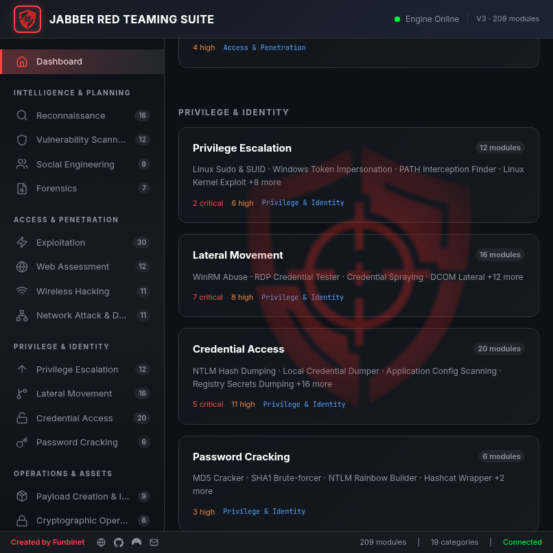
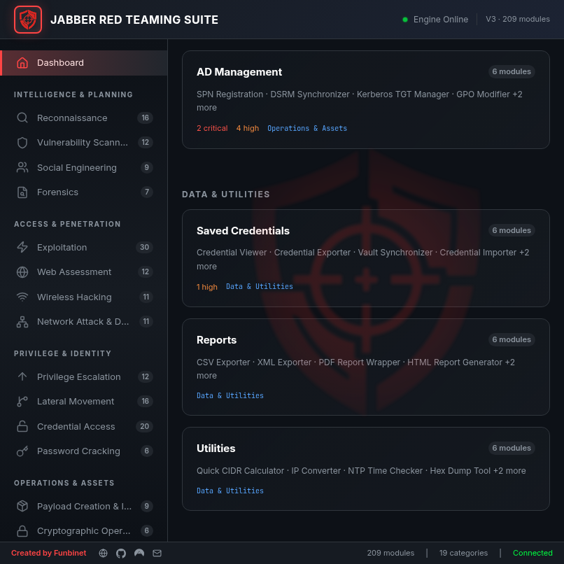

## Architecture

```
┌──────────────────────────────────────────────────────────────┐
│                    JABBER V3 Architecture                     │
├──────────────────────────────────────────────────────────────┤
│                                                              │
│   ┌──────────┐    REST API     ┌──────────────────────┐     │
│   │  React   │ ◄─────────────► │   Spring Boot 3      │     │
│   │  Frontend│   port 5173     │   Backend (port 8314) │     │
│   │  (Vite)  │                 │                      │     │
│   └──────────┘                 │  ┌────────────────┐  │     │
│        │                       │  │ PluginRegistry │  │     │
│   ┌──────────┐                 │  │ TaskEngine     │  │     │
│   │ Electron │                 │  │ ReportEngine   │  │     │
│   │ Desktop  │                 │  │ ProfileEngine  │  │     │
│   └──────────┘                 │  │ StorageService │  │     │
│                                │  └────────────────┘  │     │
│                                └──────────┬───────────┘     │
│                                           │                  │
│                                ┌──────────▼───────────┐     │
│                                │   209 Modules         │     │
│                                │   (16 packages)       │     │
│                                │   jrts-modules/       │     │
│                                └──────────────────────┘     │
└──────────────────────────────────────────────────────────────┘
```

### Component Breakdown

| Component | Technology | Location |
|-----------|-----------|----------|
| Backend | Java 21, Spring Boot 3 | `jrts-core/` |
| Modules | Java plugins, 16 category packages | `jrts-modules/` |
| Data Layer | H2 database, JPA entities | `jrts-data/` |
| Frontend | React 19, Vite 8, Lucide icons | `jrts-ui/` |
| Desktop | Electron 41 | `jrts-ui/electron/` |
| Startup | Bash (run.sh / stop.sh) | Project root |
| Packaging | Debian .deb builder | `packaging/` |
| Reports | JSON, HTML, multi-format | `reports/` |

## Module Categories

All **209 modules** are organized across **19 categories** in 5 lifecycle groups:

### Intelligence & Planning

| Category | Modules | Screenshot |
|----------|---------|------------|
| Reconnaissance | 16 |  |
| Vulnerability Scanning | 12 |  |
| Social Engineering | 9 | 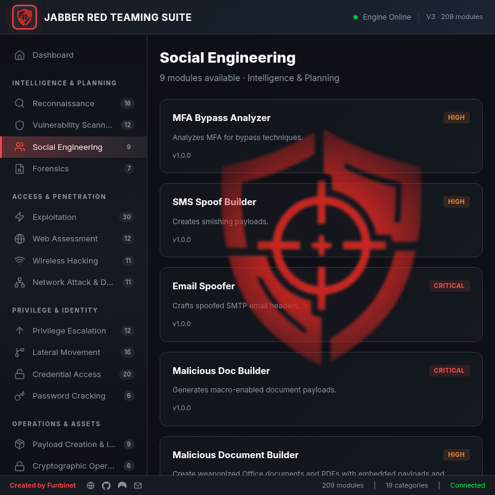 |
| Forensics | 7 |  |

### Access & Penetration

| Category | Modules | Screenshot |
|----------|---------|------------|
| Exploitation | 30 |  |
| Web Assessment | 12 | 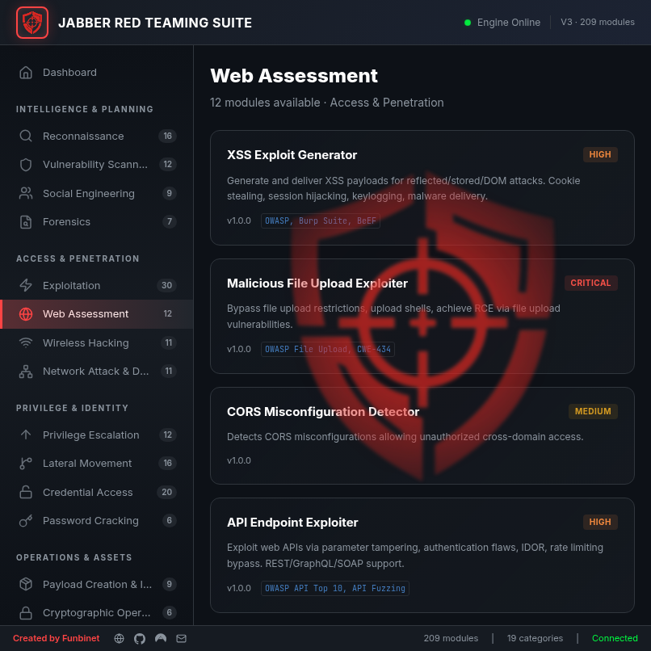 |
| Wireless Hacking | 11 | 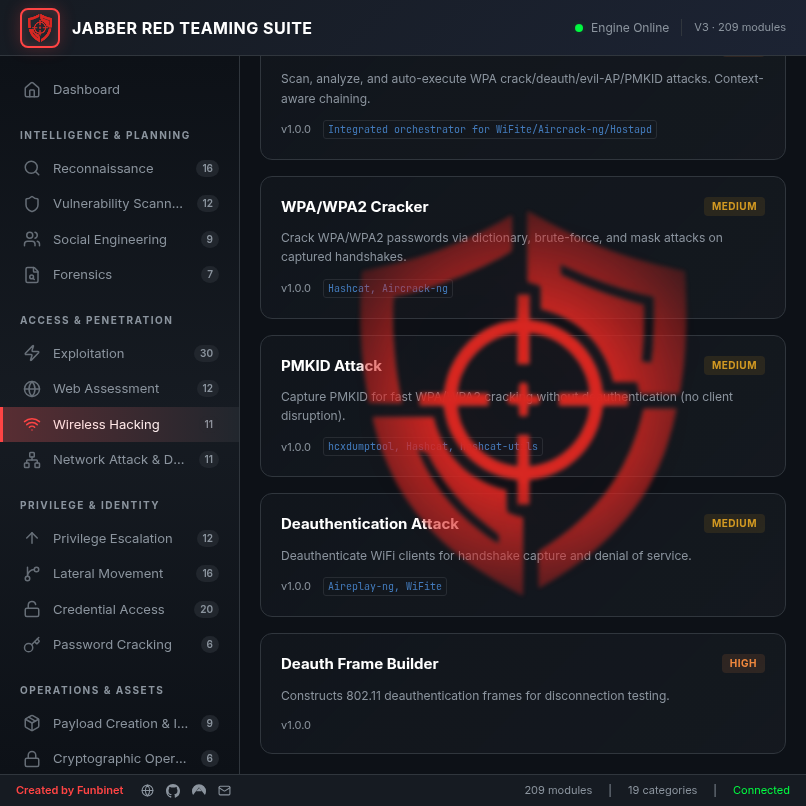 |
| Network Attack & Defense | 11 | 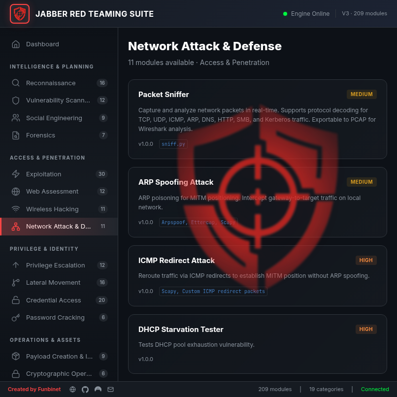 |

### Privilege & Identity

| Category | Modules | Screenshot |
|----------|---------|------------|
| Privilege Escalation | 12 |  |
| Lateral Movement | 16 | 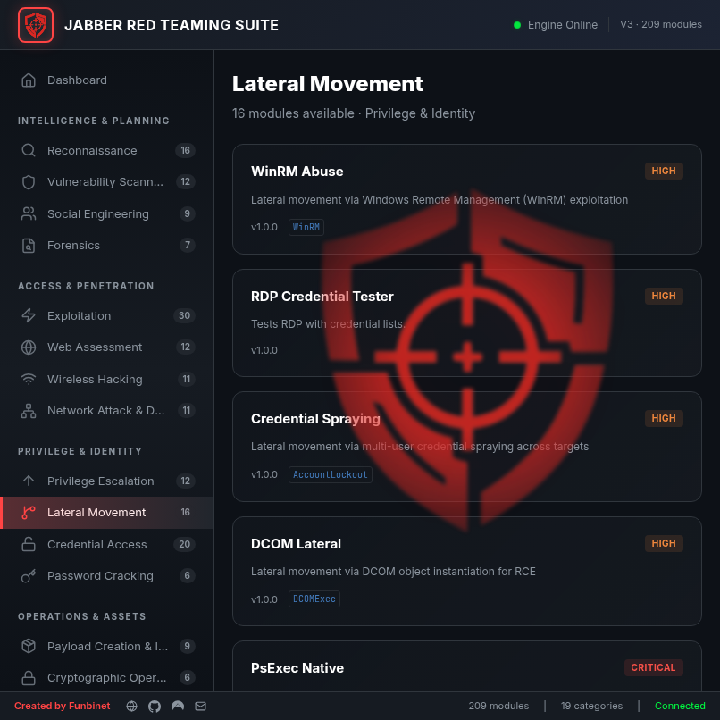 |
| Credential Access | 20 |  |
| Password Cracking | 6 | 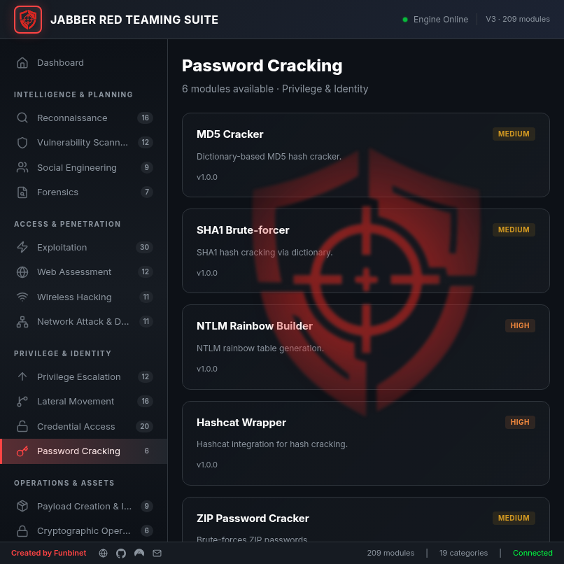 |

### Operations & Assets

| Category | Modules | Screenshot |
|----------|---------|------------|
| Payload Creation & Injection | 9 | 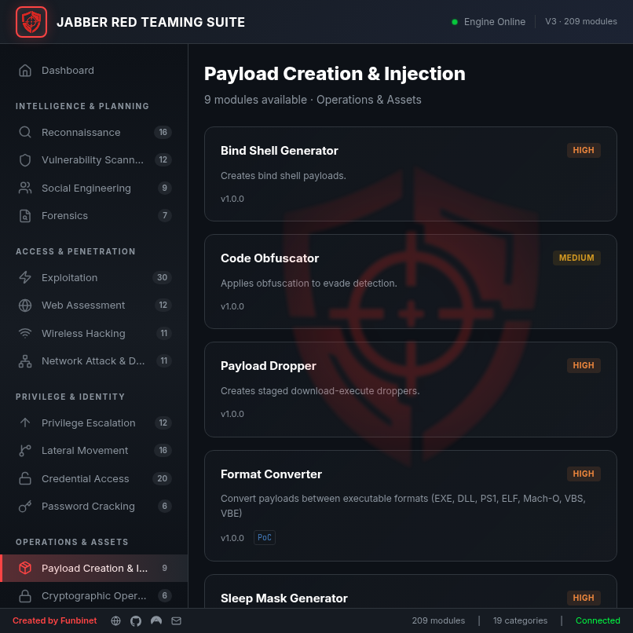 |
| Cryptographic Operations | 6 | 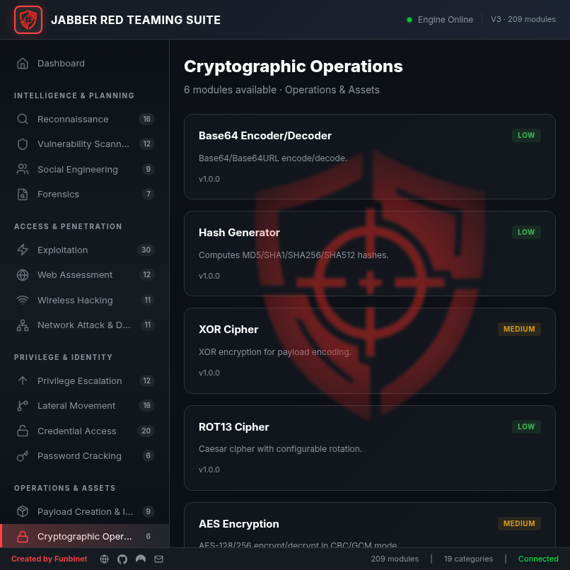 |
| C2 Server & Persistence | 8 | 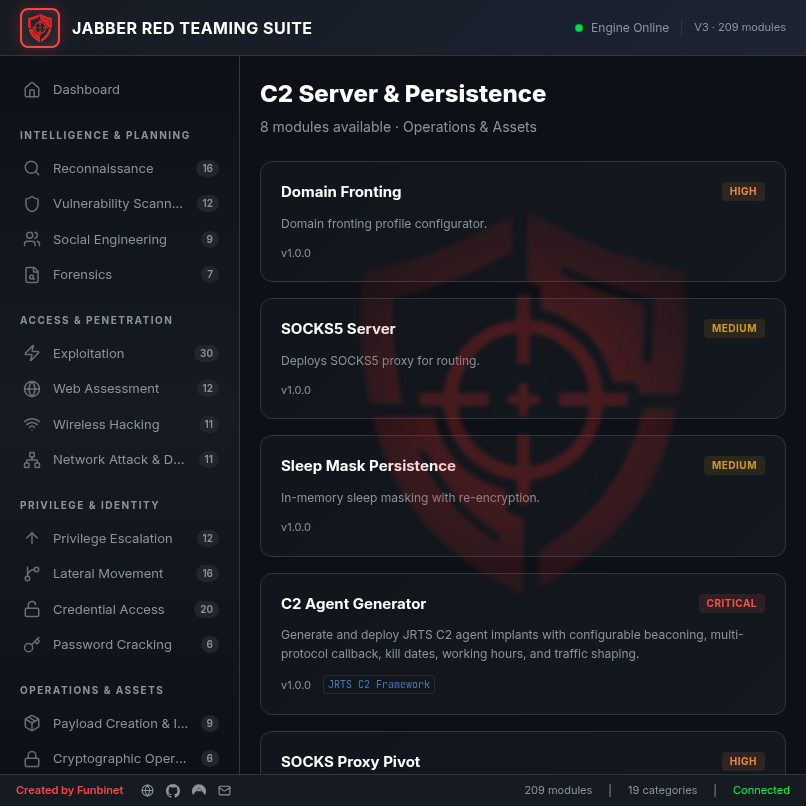 |
| AD Management | 6 | 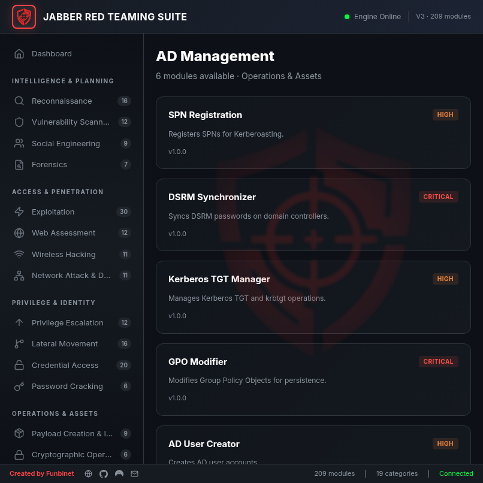 |

### Data & Utilities

| Category | Modules | Screenshot |
|----------|---------|------------|
| Saved Credentials | 6 | 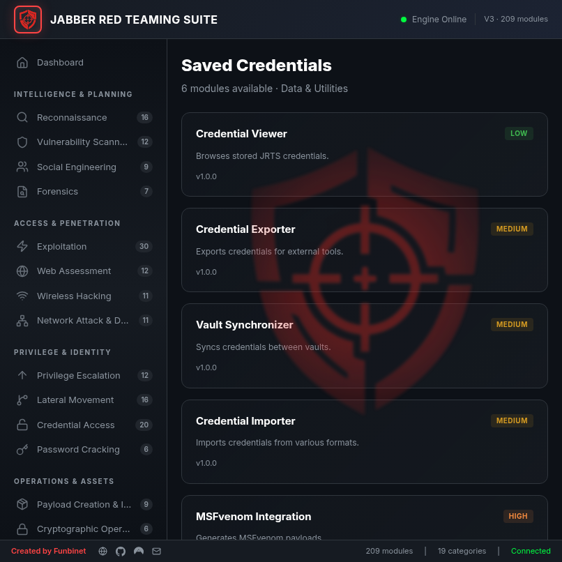 |
| Reports | 6 | — |
| Utilities | 6 | 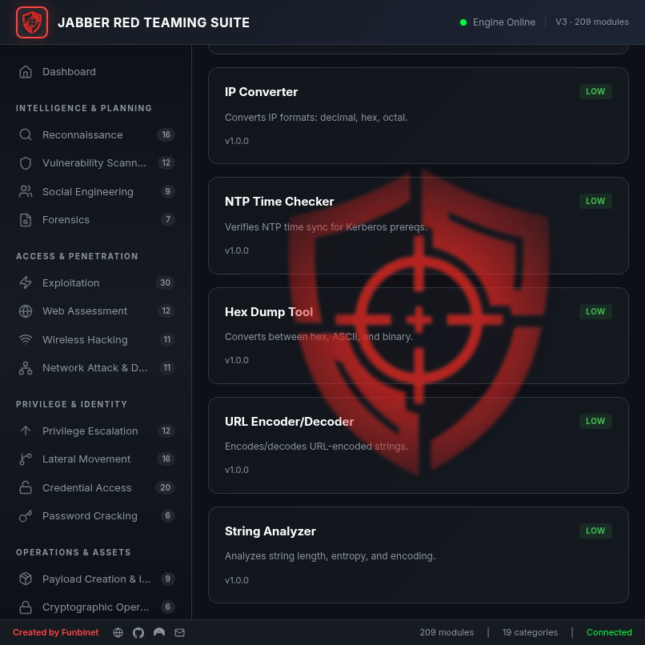 |

## Module Executor

Click any module card to open the executor panel with parameter forms, real-time terminal output, and execution controls:


## Report Manager

The V3 Report Manager provides browsing, filtering, editing, and export of all module outputs:

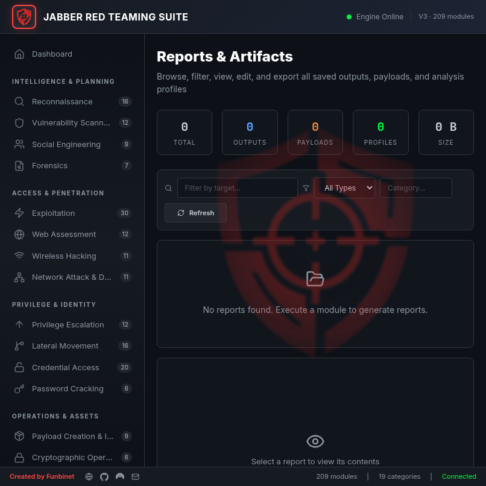

## API Reference

All API endpoints are served on port **8314**:

```bash
# System info
curl http://localhost:8314/api/info

# List all modules
curl http://localhost:8314/api/modules

# Modules by category
curl http://localhost:8314/api/modules/category/RECONNAISSANCE

# Execute a module
curl -X POST http://localhost:8314/api/modules/execute \
  -H "Content-Type: application/json" \
  -d '{"moduleId":"util-system-info"}'

# Module parameter schema
curl http://localhost:8314/api/modules/{id}/schema

# Task status
curl http://localhost:8314/api/tasks/{taskId}

# Reports
curl http://localhost:8314/api/reports
```

## Project Structure

```
jrts/
├── jrts-core/           # Spring Boot backend
│   └── src/main/java/com/jabber/jrts/core/
│       ├── api/         # REST controllers
│       ├── engine/      # TaskEngine
│       ├── plugin/      # PluginRegistry
│       ├── report/      # ReportEngine
│       ├── profiling/   # TargetProfileEngine
│       └── storage/     # ReportStorageService
├── jrts-modules/        # 209 modules (16 packages)
│   └── src/main/java/com/jabber/jrts/modules/
│       ├── reconnaissance/
│       ├── exploitation/
│       ├── credential/
│       ├── wireless/
│       ├── network/
│       ├── privesc/
│       ├── lateral/
│       ├── social/
│       ├── vulnscan/
│       ├── webapp/
│       ├── payload/
│       ├── crypto/
│       ├── c2/
│       ├── persistence/
│       ├── reporting/
│       └── utilities/
├── jrts-data/           # H2 database + JPA entities
├── jrts-ui/             # React/Electron frontend
│   ├── src/
│   │   ├── components/  # 9 React components
│   │   ├── api.js       # Backend API client
│   │   ├── App.jsx      # Main app + routing
│   │   └── index.css    # Full design system
│   └── electron/        # Electron main process
├── screenshots/         # 806×806 UI screenshots
├── reports/             # Module output artifacts
├── logs/                # Runtime logs (backend, frontend)
├── packaging/           # .deb package builder
├── frags/               # Impacket tool collection
├── run.sh               # Unified launcher (desk/web)
├── stop.sh              # Graceful shutdown
├── jabber.png           # Brand logo (1080×1080)
└── jabber-dashboard.png # Reference dashboard image
```

## Module Source Structure

All modules are located in:
```
jrts-modules/src/main/java/com/jabber/jrts/modules/
```

Each category directory contains Java classes implementing `JRTSModuleInterface`.

## Documentation

| Document | Purpose |
|----------|---------|
| [README.md](README.md) | Getting started, architecture, screenshots |
| [MODULES.md](MODULES.md) | Complete 209-module catalog |
| [ARCHITECTURE.md](ARCHITECTURE.md) | System architecture deep-dive |
| [LICENSE.md](LICENSE.md) | Proprietary license agreement |
| [packaging/README_DEB.md](packaging/README_DEB.md) | Debian package guide |

## Production Features

- ✅ 209 native security modules across 19 categories
- ✅ Spring Boot 3 backend on port 8314
- ✅ React 19 / Vite 8 frontend
- ✅ Electron 41 desktop wrapper
- ✅ Unified output management (V3)
- ✅ Target profiling engine (V3)
- ✅ 30 exploitation modules (V3)
- ✅ Report storage with filesystem persistence
- ✅ Multi-format export (JSON, HTML, CSV, XML, Markdown)
- ✅ `.deb` package installer with `jabber` CLI command
- ✅ Structured logging (logs/ directory)
- ✅ PID-based process management

## License

See [LICENSE.md](LICENSE.md)

## Contact

- **Website**: [dancan.tech](https://dancan.tech)
- **GitHub**: [github.com/funbinet](https://github.com/funbinet)
- **Codeberg**: [codeberg.org/funbinet](https://codeberg.org/funbinet)
- **Email**: funbinet@gmail.com

---

<div align="center">

**JABBER Red Teaming Suite V3** · All Systems Ready ✅  
**© 2026 Funbinet Inc. All Rights Reserved.**

</div>
